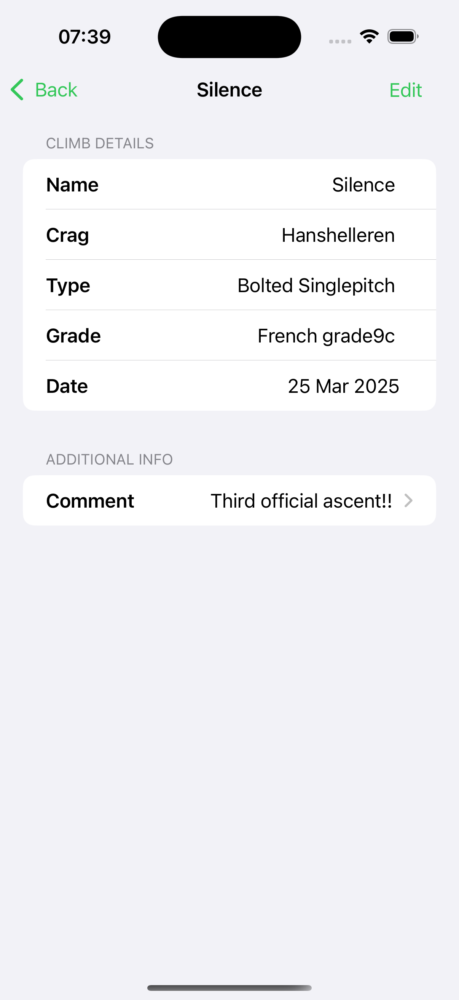

# Ticklist

Third iteration of an iOS application for logging different types of rock climbing ascents.

## Technologies
- Frontend: SwiftUI
- Backend: Swift
- Persistence: SwiftData

## Demo

    
    
    

